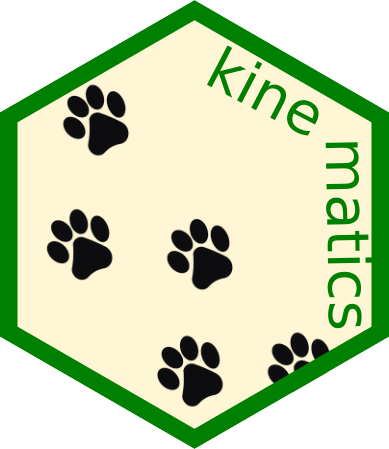
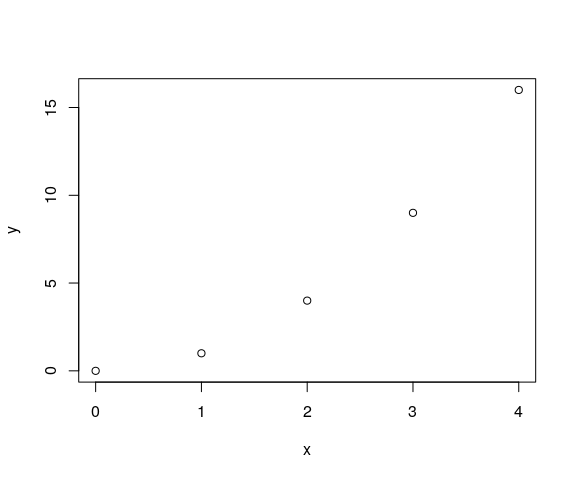
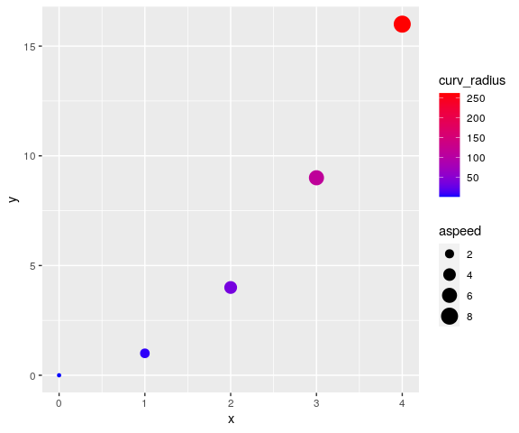
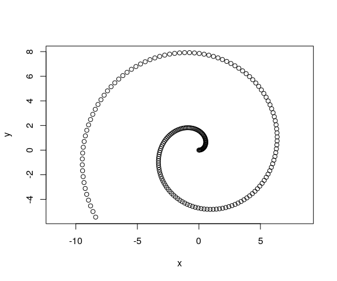
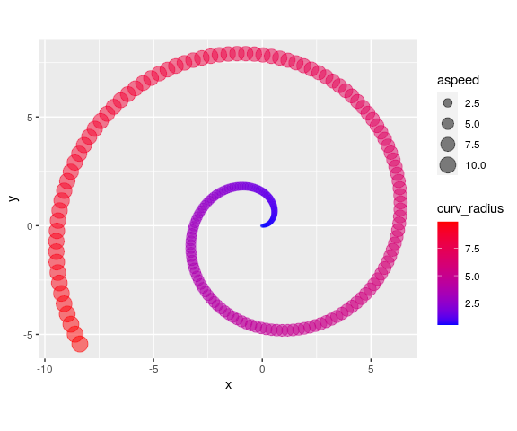
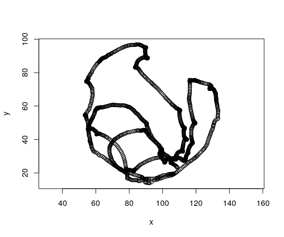
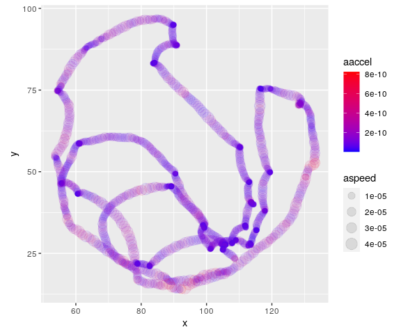
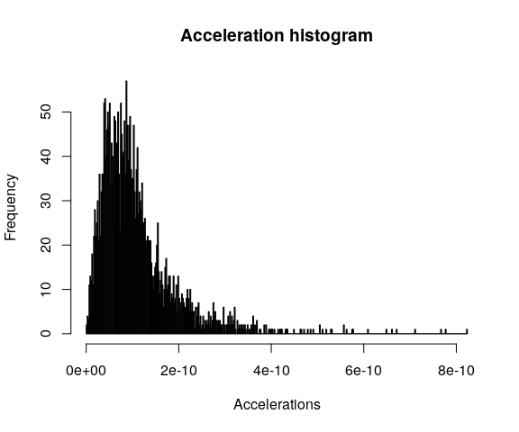

[](https://github.com/PabRod/kinematics/actions)
[](https://codecov.io/gh/PabRod/kinematics)
[](https://doi.org/10.5281/zenodo.5107804)
[](https://opensource.org/licenses/MIT)
[](https://fair-software.eu)


# Kinematics 

Allows analyzing time series representing two-dimensional movements.
It accepts a data frame with a time (t), horizontal (x) and vertical (y) 
coordinate as columns, and returns several dynamical properties such as speed, 
acceleration or curvature.

## Motivation and purpose

This package was born as a collaboration between a physicist and an
experimental biologist. Everything started when our department bought a
fancy device for tracking the positions of a small organism on a Petri
dish.

Long story short, the device captured several images per second, and
managed to identify the horizontal and vertical positions of the
organism under study. The output produced by the software contained time
series with values of the sampling times *t*, and the corresponding
two-dimensional positions (*x*, *y*). Unfortunately, this output also
contained some obscure and difficult to manage processed data.

We decided to write our own analysis software for these sampled
trajectories, using only the fundamental information about movement
(that is: *t*, *x* and *y*, see more on section below). This type of
data, although inspired by the particular problem of the organism’s
tracker, is completely general and applicable to any object moving in
two dimensions.

Our package returns different properties of that movement, such as the
instantaneous speeds, accelerations and curvatures.

## Installation

This is an *R* package. [*R*](https://www.r-project.org/) is required,
[*RStudio*](https://www.rstudio.com/) is recommended.

In order to use the package, we have to install it. The easiest way to
install it is via the [`devtools`](https://devtools.r-lib.org/) official
CRAN package.

```r
devtools::install_github("PabRod/kinematics")
```

After installing, we have to attach the package as usual:

```r
library(kinematics)
```

And we are ready to go!

## Basic usage

### Movement and how to store it

This is a package for studying movement. So we need a way of coding
movement into an object. This is R, so you guessed it! We’ll code
movement in the form of a data frame.

If you ask a kid to describe what movement is, probably he will trace a
curve in the air with the tips of his fingers. And he will be right,
that’s movement indeed! The apparently simple idea of “tracing a curve
with the tips of your fingers” can be abstracted to the idea of a
position that changes on time. One possible way of representing this is
by a **list of times and their corresponding positions**.

Particularly, our data frames representing movement will have three
columns:

-   The *t* column: representing time
-   The *x* column: representing the horizontal position at the time *t*
-   The *y* column: representing the vertical position at the time *t*

A minimal example could be:

```r
mov <- data.frame(t = c(0, 1, 2, 3, 4), 
                  x = c(0, 1, 2, 3, 4), 
                  y = c(0, 1, 4, 9, 16))
```

that represents five steps of what seems to be a parabolic movement:

```r
plot(mov$x, mov$y, xlab = "x", ylab = "y")
```



Notice that the insides of the data frame look like below:

```r
#>   t x  y
#> 1 0 0  0
#> 2 1 1  1
#> 3 2 2  4
#> 4 3 3  9
#> 5 4 4 16
```

where each row represents one “footprint”, that is, one snapshot of the
movement. For instance, we see that at *t*=2, the position of the
organism was (x, y) = (2,4).

### Extracting movement properties

Movement has much more properties than just position. Some examples are
speed, acceleration, curvature and displacement. The branch of physics
that deals with this kind of problems is known as
[kinematics](https://en.wikipedia.org/wiki/Kinematics). In this package,
we implemented some of the classical algorithms of kinematics. We did it
in what we think is a practical and easy-to-use fashion.

**The function `append_dynamics` is a way of extracting as much movement
properties as possible**. If we apply it to `mov`, the resulting data
frame contains much more columns:

```r
mov_analyzed <- append_dynamics(mov)

#>   t x  y vx vy   aspeed            ax ay aaccel        curv curv_radius disp_x
#> 1 0 0  0  1  0 1.000000 -3.420544e-12  2      2 2.000000000     0.50000     NA
#> 2 1 1  1  1  2 2.236068 -6.539938e-14  2      2 0.178885438     5.59017      1
#> 3 2 2  4  1  4 4.123106  3.250388e-14  2      2 0.028533603    35.04640      1
#> 4 3 3  9  1  6 6.082763  2.179979e-14  2      2 0.008886432   112.53111      1
#> 5 4 4 16  1  8 8.062258 -1.726720e-12  2      2 0.003816453   262.02338      1
#>   disp_y    adisp
#> 1     NA       NA
#> 2      1 1.414214
#> 3      3 3.162278
#> 4      5 5.099020
#> 5      7 7.071068
```

These new columns are:

- `vx`, `vy` and `aspeed`: horizontal, vertical and absolute speed.
- `ax`, `ay`, and `aaccel`: horizontal, vertical and absolute
  acceleration.
- `curv` and `curv_radius`: curvature and curvature radius.
- `disp_x`, `disp_y` and `adisp`: horizontal, vertical and absolute
  displacement (since previous time step).

#### A note about units

The units of *x* and *y* are expected to be the same (say, meters). All
the new columns derive their units from thse of *t* and *x* that is:

- Speeds’ units are: *x* unit divided by *t* unit.
- Acceleration’s units are: *x* unit divided by *t* unit squared.
- Curvature unit is 1 divided by *x* unit.
- Curvature radius’ unit is the same as *x*.
- Displacements’ units are the same as *x*.

The new columns are ready to be analyzed. For example, we can visualize
curvature and absolute speed using `ggplot2`:

```r
library(ggplot2)
ggplot(data = mov_analyzed, 
       mapping = aes(x = x, y = y, col = curv_radius, size = aspeed)) +
       geom_point() +
       scale_color_gradient(low="blue", high="red")
```



## More realistic examples

### Parametric equation of movement

A common way of describing movement in physics is by assigning a
function of time to *x* and *y*. For instance, an Archimedean spiral is
known to follow the equations below:


We can encode it, and sample at intervals of 0.05 units of time, using
the snippet below:

```r
# Generate the times
ts <- seq(0, 10, by = 0.05)

# Calculate the positions using a function
xs <- ts * cos(ts)
ys <- ts * sin(ts)

# Store as data frame
mov <- data.frame(t = ts, 
                  x = xs, 
                  y = ys)
```

The data looks like this:

```r
plot(mov$x, mov$y, xlab = "x", ylab = "y", asp = 1)
```



And repeating the analysis shown in the previous example, we can
significantly enrich the features we can see on the data. For instance,
once again, we use color to plot curvature radii and size to plot
absolute speed.

```r
mov_analyzed <- append_dynamics(mov)

ggplot(data = mov_analyzed, 
       mapping = aes(x = x, y = y, col = curv_radius, size = aspeed)) +
       geom_point(alpha = 0.5) +
       coord_fixed() +
       scale_color_gradient(low="blue", high="red")
```



### Sampled curve

Much more interesting examples will come from actual **sampled** data,
such as the ones that our device produced. In that case, we’ll have to
load the data from whatever external source we used, and transform it to
the (t, x, y) data frame format. Sometimes, we’ll also need to clean the
data a bit (for instance, removing NAs, artifacts, … you know [the
drill](https://cengel.github.io/R-data-wrangling/)).

For pedagogical purposes, we include an example data set in this
package. The curve was traced by a macroinvertebrate called *Asella*
inside a Petri dish (no animals were harmed in the making of this
package).

This is how it looks after importing and cleaning:

```r
mov <- kinematics::example_mov

plot(mov$x, mov$y, xlab = "x", ylab = "y", asp = 1)
```


Using `append_dynamics` we can extract a lot of significant information:
And this is an example of how our analysis enriches the information
contained on it:

```r
mov_analyzed <- append_dynamics(mov)
```
And use the power of R to, for instance, make nice plots. Such as this
one that maps acceleration to color and speed to marker size.

```r
ggplot(data = mov_analyzed, 
       mapping = aes(x = x, y = y, col = aaccel, size = aspeed)) +
       geom_point(alpha = 0.1) +
       coord_fixed() +
       scale_color_gradient(low="blue", high="red")
```



Or a histogram about accelerations:

```r
hist(mov_analyzed$aaccel, 
     breaks = 500, 
     xlab = 'Accelerations', 
     main = 'Acceleration histogram')
```



## Citation

Please use the information below to compose your citation of this software.

```
Pablo Rodríguez-Sánchez, & Sanne J.P. van den Berg.
(2021, July 15). 
PabRod/kinematics 
Zenodo. 
http://doi.org/10.5281/zenodo.5107804
```

Different citation formats can be automatically generated from [Zenodo](https://doi.org/10.5281/zenodo.5107804).

## Authors

- [Pablo Rodríguez-Sánchez](https://pabrod.github.io)
- [Sanne J.P. van den Berg](https://www.wur.nl/en/Persons/Sanne-dr.-SJP-Sanne-van-den-Berg.htm)

## License

This project is licensed under the MIT License - see the [LICENSE.md](LICENSE) file for details
